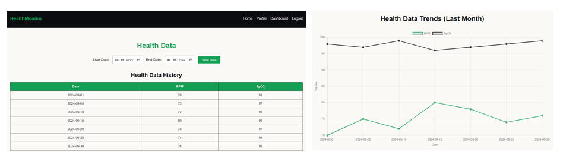

# MDAP-EX_01-Portfolio
## Date: 12-08-2025

## AIM
To create a Portfolio using HTML and CSS.

## ALGORITHM
### STEP 1
Create an HTML file (index.html)

### STEP 2
Create a CSS file (style.css)

### STEP 3
Include a navigation bar with links to different sections.

### STEP 4
Add structured sections for introduction, about, projects, and contact details.

### STEP 5
Define global styles for fonts, colors, and layout.

### STEP 6
Style the header, navigation bar, and sections.

### STEP 7
Use Flexbox or CSS Grid for layout design.

### STEP 8
Add hover effects and transitions for interactivity.

### STEP 9
Add Images and Media.

### STEP 10
Use optimized images for a professional look.

### STEP 11
Open the HTML file in a browser to check layout and functionality.

### STEP 12
Fix styling issues and refine content placement.

### STEP 13
Deploy the Portfolio.

### STEP 14
Upload to GitHub Pages for free hosting.

## PROGRAM
### index.html
```
<!DOCTYPE html>
<html lang="en">
<head>
    <meta charset="UTF-8">
    <meta name="viewport" content="width=device-width, initial-scale=1.0">
    <title>My Portfolio</title>
    <link rel="stylesheet" href="style.css">
</head>
<body>

    <header>
        <nav class="navbar">
            <div class="logo">MyPortfolio</div>
            <ul class="nav-links">
                <li><a href="#home">Home</a></li>
                <li><a href="#about">About</a></li>
                <li><a href="#projects">Projects</a></li>
                <li><a href="#contact">Contact</a></li>
            </ul>
        </nav>
    </header>

    <section id="home" class="intro">
        <h1>Hello, I'm <span>Ashwin</span></h1>
        <p>Aspiring Full Stack Developer</p>
    </section>

    <section id="about" class="about">
        <h2>About Me</h2>
        <p>
            I am passionate about building modern web applications with clean UI and efficient backend systems.
            Skilled in HTML, CSS, JavaScript, and learning frameworks like React and Spring Boot.
        </p>
    </section>

    <section id="projects" class="projects">
        <h2>Projects</h2>
        <div class="project-list">
            <div class="project-card">
                <h3>OKR Management App</h3>
                <p>A full-stack OKR management system with role-based access and progress tracking.</p>
            </div>
            <div class="project-card">
                
                <h3>Health Monitoring IoT</h3>
                <p>IoT-based system for real-time health monitoring using ESP32 and sensors.</p>
            </div>
        </div>
    </section>

    <section id="contact" class="contact">
        <h2>Contact Me</h2>
        <p>Email: <a href="mailto:namikazeashwin@gmail.com">ashwin@gmail.com.com</a></p>
        <p>Phone: +91 9884537778</p>
    </section>

    <footer>
        <p>&copy; 2025 Ashwin. All rights reserved.</p>
    </footer>

</body>
</html>
```
### style.css
```
* {
    margin: 0;
    padding: 0;
    box-sizing: border-box;
}
body {
    font-family: Arial, sans-serif;
    line-height: 1.6;
    background-color: #ff7171;
    color: #333;
}

header {
    background: #222;
    color: #fff;
    padding: 1rem 0;
}
.navbar {
    display: flex;
    justify-content: space-between;
    align-items: center;
    width: 90%;
    margin: auto;
}
.logo {
    font-size: 1.5rem;
    font-weight: bold;
}
.nav-links {
    list-style: none;
    display: flex;
}
.nav-links li {
    margin-left: 20px;
}
.nav-links a {
    color: #fff;
    text-decoration: none;
}
.nav-links a:hover {
    color: #ff9800;
}

.intro {
    color: #fff;
    text-align: center;
    padding: 100px 20px;
}
.intro h1 {
    font-size: 2.5rem;
}

.intro p {
    font-size: 1.2rem;
    margin-top: 10px;
}

.about, .projects, .contact {
    padding: 50px 20px;
    max-width: 900px;
    margin: auto;
}
.about h2, .projects h2, .contact h2 {
    text-align: center;
    margin-bottom: 20px;
}

.project-list {
    display: flex;
    gap: 20px;
    flex-wrap: wrap;
    justify-content: center;
}
.project-card {
    background: #fff;
    border-radius: 8px;
    overflow: hidden;
    width: 300px;
    box-shadow: 0 4px 8px rgba(0,0,0,0.1);
}
.project-card:hover {
    transform: scale(1.05);
}
.project-card img {
    width: 100%;
    height: 180px;
    object-fit: cover;
}
.project-card h3 {
    padding: 10px;
}
.project-card p {
    padding: 0 10px 10px;
}

.contact p {
    text-align: center;
    margin: 10px 0;
}
.contact a {
    color: #ffffff;
    text-decoration: none;
}
.contact a:hover {
    text-decoration: underline;
}

footer {
    background: #222;
    color: #fff;
    text-align: center;
    padding: 15px 0;
    margin-top: 20px;
}
```
## OUTPUT


## RESULT
The program for creating Portfolio using HTML and CSS is executed successfully.
